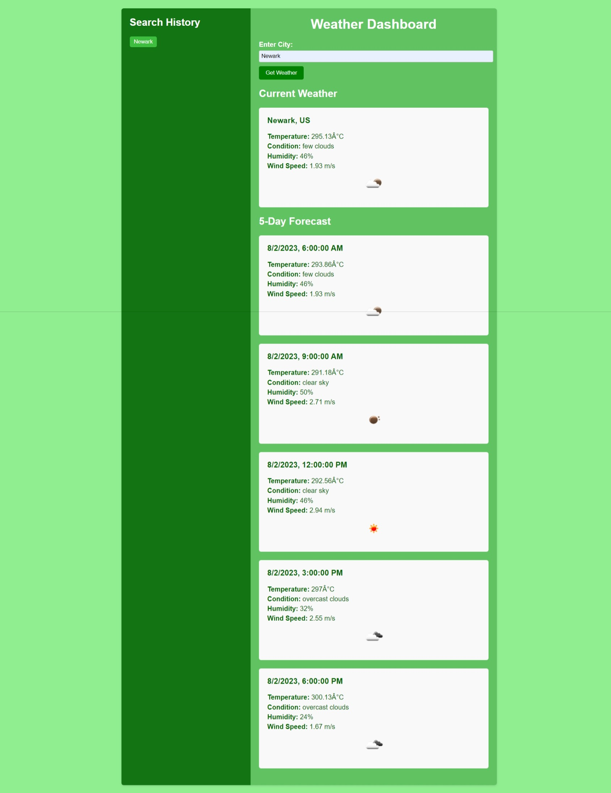

# Weather_Dashboard
  ## Licence:
  

  ## Description
 Third-party APIs allow developers to access their data and functionality by making requests with specific parameters to a URL. Developers are often tasked with retrieving data from another application's API and using it in the context of their own. This weather dashboard application will run in the browser and feature dynamically updated HTML and CSS.

 ## User Story

```
AS A traveler
I WANT to see the weather outlook for multiple cities
SO THAT I can plan a trip accordingly
```

## Acceptance Criteria

```
GIVEN a weather dashboard with form inputs
WHEN I search for a city
THEN I am presented with current and future conditions for that city and that city is added to the search history
WHEN I view current weather conditions for that city
THEN I am presented with the city name, the date, an icon representation of weather conditions, the temperature, the humidity, and the wind speed
WHEN I view future weather conditions for that city
THEN I am presented with a 5-day forecast that displays the date, an icon representation of weather conditions, the temperature, the wind speed, and the humidity
WHEN I click on a city in the search history
THEN I am again presented with current and future conditions for that city
```

  ## Table of Contents
  - [Installation](#installation)
  - [Usage](#usage)
  - [Credits](#credits)

  ## Installation
  This is a screenshot of the application:


  - This is the link to the deployed app: https://isaiasd18.github.io/weather_dashboard/
  
  

  ## Usage
  - You can run it locally by cloning the repo and opening the index.html file in your browser.
  - You can just go to the the deployed app and start using it there.


  ## Credits
  N/A
